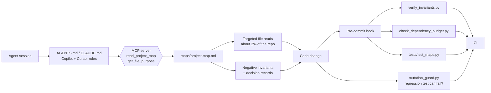

# AI-Native Context & Guardrails Framework

**Stop AI coding agents from drifting, wasting tokens, and "cleaning up" the code that was
protecting you.**

A small, dependency-free toolkit that gives Claude Code, Cursor, GitHub Copilot, and other LLM
agents a *map* of your project and a set of *checks* they cannot talk their way around.

- **Zero dependencies.** Python 3.9+ standard library only. Nothing to `pip install`.
- **Works with any agent.** `AGENTS.md`, `CLAUDE.md`, Copilot instructions, Cursor rules, and an MCP server.
- **Enforced, not just requested.** Every rule that matters is backed by a script, a test, a git hook, or CI.

---

## The problem

| Failure mode                | What it looks like                                                     |
| --------------------------- | ---------------------------------------------------------------------- |
| **Context drift**           | The agent invents structure, edits the wrong file, or uses a stale API. |
| **Token waste**             | Half the window is spent grepping and reading files just to orient.     |
| **Destructive refactoring** | A "redundant" guard is deleted; a bug you fixed last month comes back.  |

## The idea

```text
   Agent starts a task
          |
          v
   AGENTS.md ---- four rules ------------------------------+
          |                                                |
          v                                                |
   maps/project-map.md   (read, do not grep)               |
          |        \                                       |
          |         +-- invariants + decisions for the file|
          v                                                |
   Read only the 1-2 files that matter                     |
          |                                                |
          v                                                |
   Change code  --->  pre-commit hook + CI  <--------------+
                       |- verify_invariants.py    (AST rules)
                       |- check_dependency_budget.py
                       |- tests/test_maps.py      (map is complete)
                       '- mutation_guard.py       (tests can fail)
```



## The four rules

Defined in [`AGENTS.md`](AGENTS.md) and mirrored to every agent format:

1. **Map before search.** Read `maps/project-map.md` before any exploratory `grep` or `find`.
2. **No fix without a regression test.** And the test must survive mutation verification.
3. **Consent before destruction.** Ask before `git push --force`, deleting data, or wiping files.
4. **Zero unauthorized dependencies.** Standard library first.

## Quickstart (3 minutes)

Clone or download this repository next to your project, then run these from **your project's root**.

**1. Copy the framework in** (30 seconds)

```bash
FRAMEWORK=../ai-context-mapping                  # path to this repository
cp -r "$FRAMEWORK/scripts" "$FRAMEWORK/mcp" "$FRAMEWORK/invariants" "$FRAMEWORK/decisions" "$FRAMEWORK/personas" .
mkdir -p maps tests .github/workflows .cursor/rules
cp "$FRAMEWORK/.agentignore" .agentignore
cp "$FRAMEWORK/templates/python/AGENTS.md" AGENTS.md     # or templates/typescript, templates/generic
cp AGENTS.md CLAUDE.md
cp "$FRAMEWORK/templates/python/tests/test_maps.py" tests/  # TypeScript: templates/typescript/tests/
cp "$FRAMEWORK/.github/copilot-instructions.md" .github/
cp "$FRAMEWORK/.github/workflows/ai-guardrails.yml" .github/workflows/
cp "$FRAMEWORK/.cursor/rules/context-guardrails.mdc" .cursor/rules/
```

Review `decisions/0001-no-database-file-store.yaml` and `invariants/negative-invariants.md`: keep
what applies, delete what does not (for example, remove ADR-0001 if your project uses a
database).

**2. Generate and describe your map** (1 minute)

```bash
python scripts/init_mapping.py          # scans the tree, honors .agentignore
```

Open `maps/project-map.md` and replace every auto-generated purpose with one accurate line.
The test refuses placeholders, so nothing stays vague.

**3. Turn the guardrails on** (1 minute)

```bash
python -m pytest -q tests               # the map test must pass
python scripts/verify_invariants.py     # exits 0 when all rules hold
sh scripts/install_hooks.sh             # run the checks on every commit
```

**4. Connect your agent (optional, recommended)**

Add the MCP server to Claude Desktop or Cursor. Ready-to-paste config is in
[`mcp/README.md`](mcp/README.md).

From now on, adding a file without describing it in the map fails the build.

## Feature matrix

| Capability                          | Prevents                          | Delivered by                                   | Runs in         |
| ----------------------------------- | --------------------------------- | ---------------------------------------------- | --------------- |
| Agent manifesto in every format     | Ignored conventions               | `AGENTS.md`, `CLAUDE.md`, Copilot, Cursor rules | Agent session   |
| Context ignore list                 | Token waste on generated files    | `.agentignore`                                 | Agent, tooling  |
| Project map generator               | Drift, blind exploration          | `scripts/init_mapping.py`                      | CLI             |
| Map completeness test               | A stale or partial map            | `tests/test_maps.py`                           | pytest, CI      |
| MCP context server                  | Grepping to orient                | `mcp/context_server.py`                        | Claude, Cursor  |
| Negative invariants                 | Deleting "redundant" guards       | `invariants/negative-invariants.md`            | Review, CI      |
| Machine-readable decisions          | Re-litigating architecture        | `decisions/*.yaml`                             | Agent, CI       |
| AST invariant checker               | Layer violations, bypassed wrappers | `scripts/verify_invariants.py`               | Hook, CI        |
| Dependency budget                   | Supply-chain creep                | `scripts/check_dependency_budget.py`           | Hook, CI        |
| Mutation guard                      | Green tests that prove nothing    | `scripts/mutation_guard.py`                    | CLI             |
| Pre-commit hook                     | Broken commits                    | `scripts/install_hooks.sh`                     | git             |
| Claude Code slash commands          | Skipped checks                    | `.claude/commands/*.md`                        | Claude Code     |
| Claude Code hooks                   | Violations left in place          | `.claude/settings.json`, `.claude/hooks/`      | Claude Code     |
| Persona cards                       | Unfocused agents                  | `personas/*.md`                                | Agent session   |
| Stack templates                     | Slow adoption                     | `templates/python`, `typescript`, `generic`    | Copy and go     |

## The tools

| Tool                                | What it does                                                               | Try it                                                        |
| ----------------------------------- | -------------------------------------------------------------------------- | ------------------------------------------------------------- |
| `init_mapping.py`                   | Generates or merges the map; detects routes and entry points               | `python scripts/init_mapping.py --merge`                      |
| `verify_invariants.py`              | Enforces `invariant-rule` blocks and lints decision records                | `python scripts/verify_invariants.py --list-rules`            |
| `check_dependency_budget.py`        | Fails on unapproved packages or too many of them                           | `python scripts/check_dependency_budget.py --print-example-config` |
| `mutation_guard.py`                 | Breaks a function on purpose; the test must go red                         | `python scripts/mutation_guard.py --help`                     |
| `context_server.py`                 | Serves the map over MCP                                                    | `python mcp/context_server.py --check`                        |

Every tool has `--help`, honors `NO_COLOR`, uses documented exit codes (`0` ok, `1` violation,
`2` usage or configuration error), and never needs a network connection.

## Claude Code integration

The repository ships a project-level `.claude/` directory, so Claude Code runs the guardrails
without being asked.

| Slash command        | What it does                                                                 |
| -------------------- | ---------------------------------------------------------------------------- |
| `/verify-map`        | Runs `init_mapping.py --check` and `pytest tests/test_maps.py`; repairs a stale map |
| `/verify-invariants` | Runs `verify_invariants.py`; fixes violations without deleting rules         |
| `/mutation-test`     | Runs `mutation_guard.py`; explains the parameters and how to read the result |
| `/diet-check`        | Runs `init_mapping.py --stats`: repository size, map size, estimated token savings |

Two hooks in `.claude/settings.json` run automatically:

- **After every edit to a `.py` file** (`PostToolUse`), the invariant checker runs on that file.
  A violation is fed back to Claude (exit code 2) so it repairs the code immediately.
- **Before every `git commit`** (`PreToolUse` on `Bash`), the dependency budget and
  `tests/test_maps.py` must pass, or the commit is blocked. Claude Code has no `PreCommit`
  event, so the hook inspects Bash commands and acts only on `git commit`.

Project hooks execute shell commands on your machine, so review `.claude/settings.json` and
`.claude/hooks/guardrail_hook.py` before trusting a copy of them. Both use only the Python
standard library. Personal overrides belong in `.claude/settings.local.json`, which
`.agentignore` excludes.

### Example: proving a test is real

```console
$ python scripts/mutation_guard.py --test tests/test_clamp.py --target src/calc.py:clamp
Mutation guard  src/calc.py:clamp  <-  tests/test_clamp.py
[ok] baseline passed (0.34s)

  #   line  operator   mutation                                       result
  0      4  neutralize replace the whole body with 'return None'      KILLED 0.36s
  1      6  compare    < -> >=                                        KILLED 0.37s
  2      7  return     return None instead of the computed value      KILLED 0.36s

Killed 3/3 mutants (100%); required at least 50%.
[ok] The tests fail when the function is broken.
```

A test that mocks the function away fails this check with *"The tests still pass when the
function does nothing."*

## Repository layout

```text
AGENTS.md  CLAUDE.md          agent manifesto (CLAUDE.md is an identical copy)
.agentignore                  paths agents must not read
.gitattributes                line-ending rules (LF for scripts and the manifesto pair)
.claude/                      Claude Code slash commands, hooks, and settings
.github/                      Copilot instructions and the CI workflow
.cursor/rules/                Cursor rules
maps/                         project-map.md (what is each file?) and site-map.md (how do I reach it?)
invariants/                   negative invariants and machine-checked rules
decisions/                    machine-readable architecture decision records
scripts/                      init_mapping, verify_invariants, check_dependency_budget,
                              mutation_guard, install_hooks
mcp/                          stdio MCP server and setup guide
personas/                     refactorer, tester, ux_architect system prompts
templates/                    python, typescript, and generic starters
tests/                        self-guarding map tests
docs/                         principles, token-diet calculator, MediaGrab case study
```

## Documentation

| Read                                                              | When you want to know                               |
| ----------------------------------------------------------------- | --------------------------------------------------- |
| [Core principles](docs/01-core-principles.md)                     | Why the framework is built this way                 |
| [Token diet calculator](docs/02-token-diet-calculator.md)         | How much context and money the map saves            |
| [Case study: MediaGrab](docs/case-study-mediagrab.md)             | What this looks like in a real architecture         |
| [Negative invariants](invariants/negative-invariants.md)          | How to protect code from well-meaning "cleanup"     |
| [Decision records](decisions/README.md)                           | How to write machine-readable ADRs                  |
| [MCP server](mcp/README.md)                                       | How to connect Claude Desktop or Cursor             |
| [Site map](maps/site-map.md)                                      | Every command, tool, and workflow at a glance       |

## Requirements and limits

- Python 3.9 or newer for the scripts and the MCP server. `pytest` is needed only to run the tests.
- Works on Linux, macOS, and Windows (`install_hooks.sh` needs a POSIX shell such as Git Bash).
- `verify_invariants.py` and `mutation_guard.py` analyze **Python**. For other languages the map,
  invariants, decisions, dependency budget, and map test still apply; see each template.
- These are guardrails against mistakes, not a sandbox against a hostile agent.

## Contributing

Contributions are welcome. The framework holds itself to its own rules:

1. **Read the map first.** Start with [`AGENTS.md`](AGENTS.md) and [`maps/project-map.md`](maps/project-map.md).
2. **Standard library only.** Scripts and the MCP server must not gain third-party imports (NI-001).
3. **Add a row for every file.** `python scripts/init_mapping.py --merge`, then write an accurate purpose.
4. **Fix bugs test-first.** Add a regression test and verify it with `mutation_guard.py`.
5. **Keep `CLAUDE.md` identical to `AGENTS.md`.** Edit `AGENTS.md`, then `cp AGENTS.md CLAUDE.md`.
6. **Explain new invariants.** Add a narrative entry, a rule if it can be machine-checked, and an
   `INVARIANT(NI-xxx)` marker.
7. **Write clear English** in docs, comments, and messages. Error messages must say what happened
   and what to do next.

Before opening a pull request, run:

```bash
python -m pytest -q tests
python scripts/init_mapping.py --check
python scripts/verify_invariants.py
python scripts/check_dependency_budget.py
```

Ideas that are especially welcome: invariant checkers for other languages, more route detectors
in `init_mapping.py`, and additional stack templates.

## License

[MIT](LICENSE)
